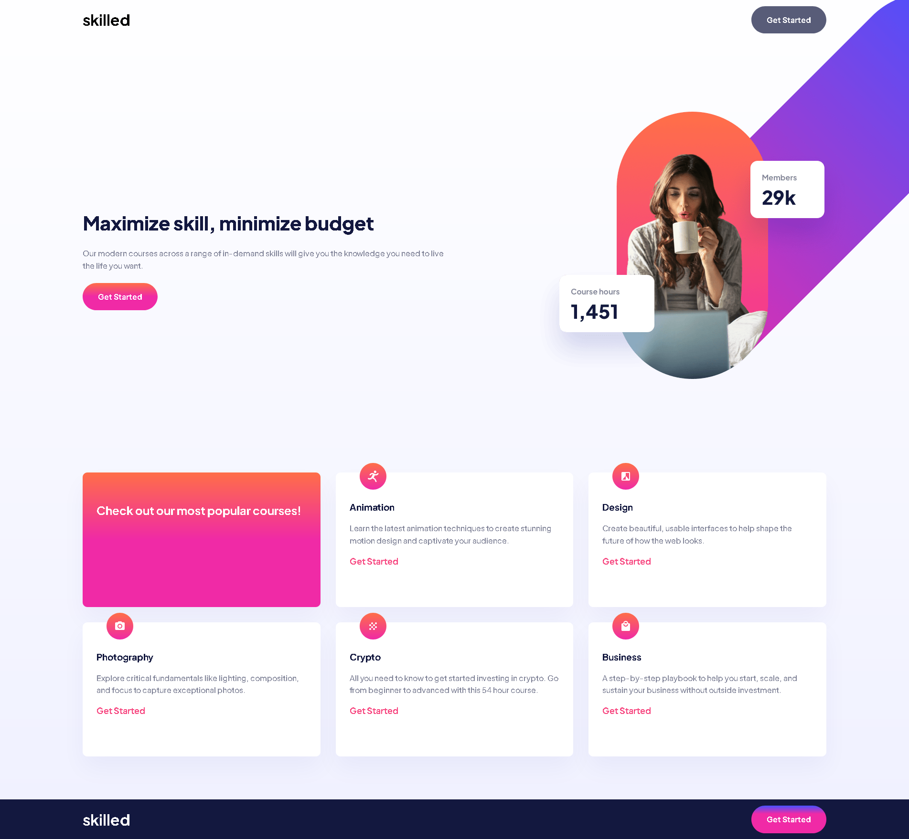

# Frontend Mentor - Skilled e-learning landing page solution

This is a solution to the [Skilled e-learning landing page challenge on Frontend Mentor](https://www.frontendmentor.io/challenges/skilled-elearning-landing-page-S1ObDrZ8q). Frontend Mentor challenges help you improve your coding skills by building realistic projects.

## Table of contents

- [Overview](#overview)
  - [The challenge](#the-challenge)
  - [Screenshot](#screenshot)
  - [Links](#links)
- [My process](#my-process)
  - [Built with](#built-with)
  - [What I learned](#what-i-learned)
  - [Continued development](#continued-development)
- [Author](#author)
- [Acknowledgments](#acknowledgments)

## Overview

### The challenge

Users should be able to:

- View the optimal layout depending on their device's screen size
- See hover states for interactive elements

### Screenshot

### Links

- Solution URL: [Add solution URL here](https://your-solution-url.com)
- Live Site URL: [Add live site URL here](https://your-live-site-url.com)

## My process

### Built with

- Semantic HTML5 markup
- CSS custom properties
- Flexbox
- CSS Grid
- Mobile-first workflow

### What I learned

I already knew a little about grid and absolute and relative position, with this project I was able to fix it a little more in my mind.

### Continued development

I need to improve in grid and positions, I think I had a satisfactory result, but it can be improved a lot. I want to focus a lot on the grid as it is very good for positioning elements in the interface.

## Author

- Github - [VHAlvesS](https://github.com/VHAlvesS)
- Frontend Mentor - [@VHAlvesS](https://www.frontendmentor.io/profile/VHAlvesS)
- Linkedin - [@vitorhasantos](https://www.linkedin.com/in/vitorhasantos/)

## Acknowledgments

I managed to do the mobile design without much difficulty, but this image in flexWrapper gave me a little headache, I have to improve my understanding of position. I think I got a satisfactory result as I was able to practice a lot with the grid in a real project.

